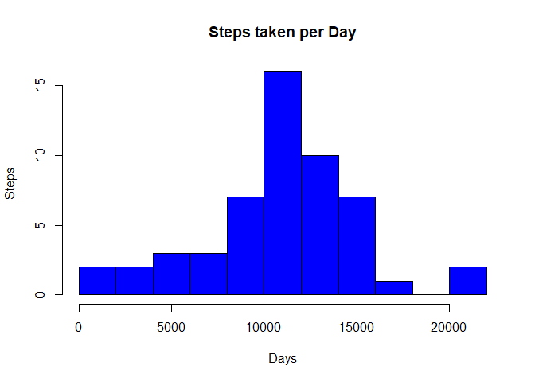
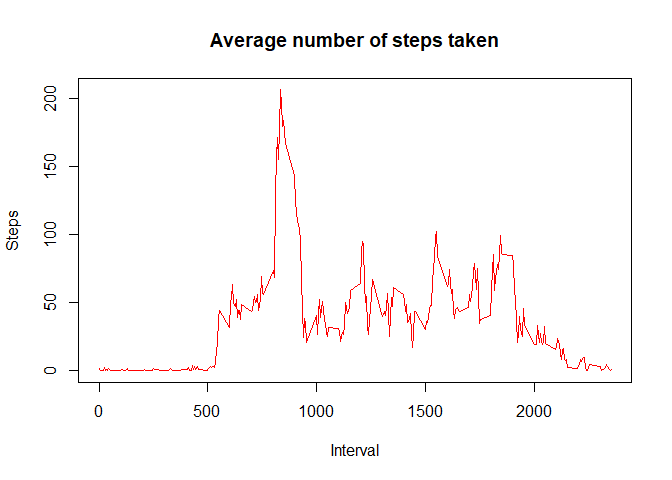
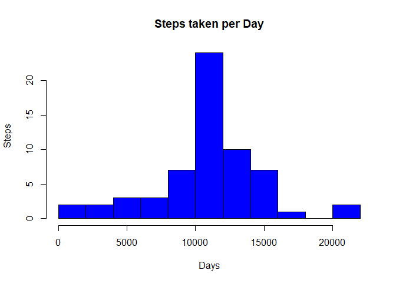
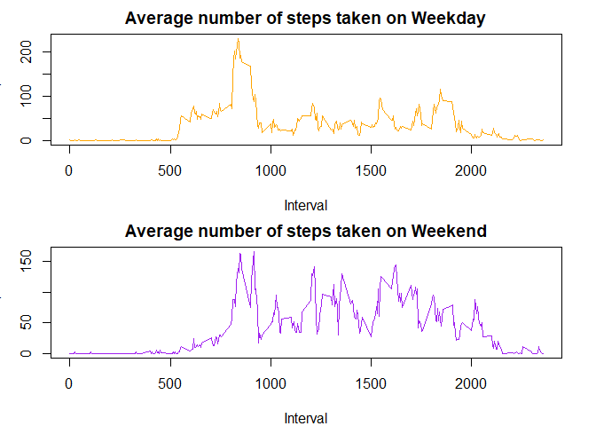

## Loading and preprocessing the data

Unzip data and loading into "activity" variable. Review structure of data.

```r
unzip("activity.zip")
activity <- read.csv("activity.csv",header=TRUE,sep=",")
head(activity)
```

```
##   steps       date interval
## 1    NA 2012-10-01        0
## 2    NA 2012-10-01        5
## 3    NA 2012-10-01       10
## 4    NA 2012-10-01       15
## 5    NA 2012-10-01       20
## 6    NA 2012-10-01       25
```

```r
summary(activity)
```

```
##      steps                date          interval     
##  Min.   :  0.00   2012-10-01:  288   Min.   :   0.0  
##  1st Qu.:  0.00   2012-10-02:  288   1st Qu.: 588.8  
##  Median :  0.00   2012-10-03:  288   Median :1177.5  
##  Mean   : 37.38   2012-10-04:  288   Mean   :1177.5  
##  3rd Qu.: 12.00   2012-10-05:  288   3rd Qu.:1766.2  
##  Max.   :806.00   2012-10-06:  288   Max.   :2355.0  
##  NA's   :2304     (Other)   :15840
```

```r
str(activity)
```

```
## 'data.frame':	17568 obs. of  3 variables:
##  $ steps   : int  NA NA NA NA NA NA NA NA NA NA ...
##  $ date    : Factor w/ 61 levels "2012-10-01","2012-10-02",..: 1 1 1 1 1 1 1 1 1 1 ...
##  $ interval: int  0 5 10 15 20 25 30 35 40 45 ...
```

## What is mean total number of steps taken per day?

For this part of the assignment, we ignore the missing values in the dataset.  
Calculate the total number of steps taken per day

```r
Total_steps <- aggregate(steps ~ date, activity, sum, na.rm=TRUE)
```
Histogram of the total number of steps taken each day   

```r
hist(Total_steps$steps,col="blue",main="Steps taken per Day", xlab="Days",ylab = "Steps",breaks=10)
```

<!-- -->
Mean and median number of steps taken each day  


```r
Mean_steps <- mean(Total_steps$steps)
print(Mean_steps)
```

```
## [1] 10766.19
```

```r
Median_steps <- median(Total_steps$steps)
print(Median_steps)
```

```
## [1] 10765
```

## What is the average daily activity pattern?

Time series plot of the average number of steps taken  

```r
Avg_Steps <- aggregate(steps ~ interval, activity, mean, na.rm=TRUE)
plot(Avg_Steps$interval,Avg_Steps$steps,col="red",type="l",main="Average number of steps taken",xlab="Interval", ylab="Steps")
```

<!-- -->
The 5-minute interval that, on average, contains the maximum number of steps

```r
Avg_Steps[which.max(Avg_Steps$steps),1]
```

```
## [1] 835
```

## Imputing missing values
Code to describe and show a strategy for imputing missing data

```r
sum(is.na(activity$steps))
```

```
## [1] 2304
```
Strategy for filling in all of the missing values in the dataset: Replacing missing values (NA) with the Average of number of Steps


```r
NewDS <- activity
for(r in 1:nrow(NewDS)){
  if (is.na(NewDS$steps[r])) {
    repl <- Avg_Steps$steps[Avg_Steps$interval == NewDS$interval[r]];
    NewDS$steps[r] <- repl;
  }
}

sum(is.na(NewDS$steps))
```

```
## [1] 0
```
Create a new dataset that is equal to the original dataset but with the missing data filled in.

```r
head(NewDS)
```

```
##       steps       date interval
## 1 1.7169811 2012-10-01        0
## 2 0.3396226 2012-10-01        5
## 3 0.1320755 2012-10-01       10
## 4 0.1509434 2012-10-01       15
## 5 0.0754717 2012-10-01       20
## 6 2.0943396 2012-10-01       25
```
Histogram of the total number of steps taken each day after missing values are imputed

```r
NewT_steps <- aggregate(steps ~ date, NewDS, sum)
hist(NewT_steps$steps,col="blue",main="Steps taken per Day", xlab="Days",ylab = "Steps",breaks=10)
```

<!-- -->
Calculate and report the mean and median total number of steps taken per day

```r
NewMean <- mean(NewT_steps$steps)
print(NewMean)
```

```
## [1] 10766.19
```

```r
NewMedian <- median(NewT_steps$steps)
print(NewMedian)
```

```
## [1] 10766.19
```
Do these values differ from the estimates from the first part of the assignment? What is the impact of imputing missing data on the estimates of the total daily number of steps?  

As I can see, mean and median get same value after imputing missing data.  

## Are there differences in activity patterns between weekdays and weekends?

For this part, use the dataset with the filled-in missing values for this part.

Create a new factor variable in the dataset with two levels – “weekday” and “weekend” indicating whether a given date is a weekday or weekend day.

```r
Wactivity <- NewDS
Wactivity$day <- weekdays(as.Date(NewDS$date))
Wactivity$type <- ifelse((Wactivity$day=="sábado"|Wactivity$day=="domingo"),"Weekend","Weekday")
table(Wactivity$type)
```

```
## 
## Weekday Weekend 
##   12960    4608
```

Make a panel plot containing a time series plot of the 5-minute interval (x-axis) and the average number of steps taken, averaged across all weekday days or weekend days (y-axis).


```r
Wd <- Wactivity[Wactivity$type=="Weekday", ]
Avg_Wd <- aggregate(steps ~ interval, Wd, mean, na.rm=TRUE)
We <- Wactivity[Wactivity$type=="Weekend", ]
Avg_We <- aggregate(steps ~ interval, We, mean, na.rm=TRUE)
par(mfrow=c(2, 1),mar=c(4, 3, 2, 2))
plot(Avg_Wd$interval,Avg_Wd$steps,col="orange",type="l",main="Average number of steps taken on Weekday",xlab="Interval", ylab="Steps")
plot(Avg_We$interval,Avg_We$steps,col="purple",type="l",main="Average number of steps taken on Weekend",xlab="Interval", ylab="Steps")
```

<!-- -->
